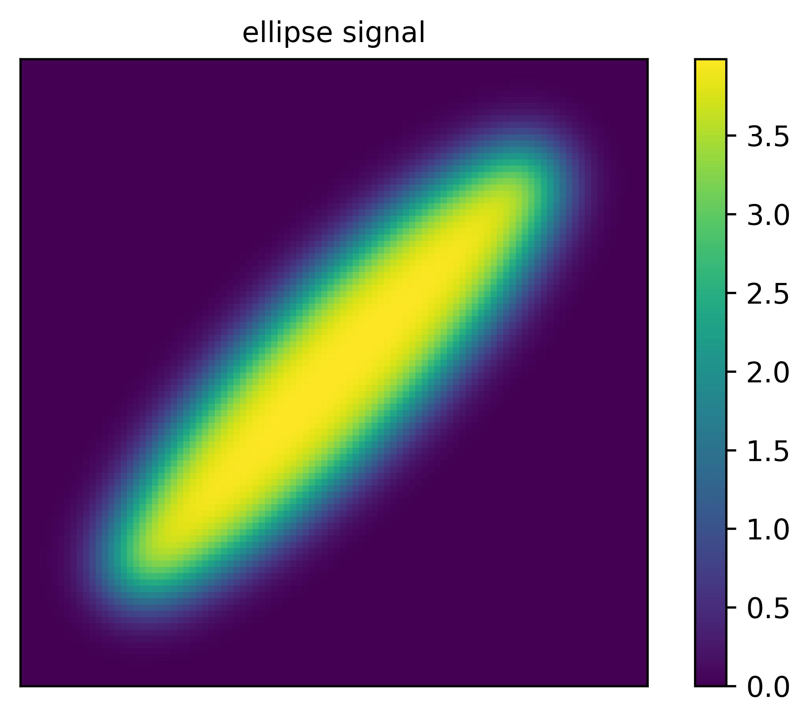
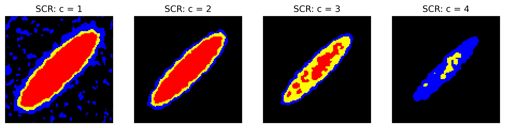

# SimuInf
[](https://www.python.org/)
[](https://creativecommons.org/licenses/by-nc/4.0/)


# SimuInf
This Python package implements methods that construct **simultaneous confidence regions** (SCRs) for an image excursion set by inverting **simultaneous confidence bands** (SCBs). A key advantage of SCRs is that they provide valid inference simultaneously across all activation thresholds. This enables researchers to fully explore the data and choose the thresholds which provide the most interesting results, without concerns about multiple comparison issues over thresholds.  Another strength of our method is that it does not require stationarity, a particular correlation structure or distribution on the noise field. This reduces bias from model misspecification compared to other methods such as classical implementations based on random field theory.


## Features 
- construct SCBs via various bootstrap methods
- construct SCRs by inverting the SCBs.
- plot the estimated excursion set and SCRs, with interactive tools specific for applications to fMRI 


## Usage

### Initial setup

1. Create a Python 3.9 or newer virtual environment.

   *If you're not sure how to create a suitable Python environment, the easiest way is using [Miniconda](https://docs.conda.io/en/latest/miniconda.html). On a Mac, for example, you can install Miniconda using [Homebrew](https://brew.sh/):*


    ```
    brew install miniconda
    ```

   *Then you can create and activate a new Python environment by running:*

    ```
    conda create --name <env> python=3.9
    conda activate <env>
    ```

2. Install the package by running:

    ```
    pip install git+https://github.com/JiyueQin/SimuInf.git
    ```

### Examples 

We illustrate the usage of the package with some simulated 2D images and compute the SCRs for the excursion sets at some thresholds. Note that you are allowed to explore all possible thresholds!

-  simulate a sample of 2D images with ellipse-shaped signals  

```
from SimuInf.random_field_generator import gen_spec, gen_2D
from SimuInf.plotting import ls_plot
import matplotlib.pyplot as plt 
# specify some parameters of the random field
spec_50, spec_100 = gen_spec(fwhm_sig=10, fwhm_noise=4, std=1, mag=4, r=0.5)
# simulate 40 images of size 100*100
data, mu = gen_2D((40,100,100), shape='ellipse', shape_spec=spec_100[1])
# plot the ellipse-shaped signal
ls_plot([mu], name_ls = ['ellipse signal'], nrow=1, figsize=(6,4), fontsize = 10, colorbar = 'individual', colorbar_location = 'right', ticks = False)
plt.show()
```



- construct simultaneous confidence regions 

```
from SimuInf.scb import confband
from SimuInf.confset import confset
import numpy as np
# compute SCB by a certain bootstrap method, default is Rademacher multiplier-t 
confband1 = confband(np.moveaxis(data, 0,-1), m_boots=1000)
# construct confidence regions (also called confidence sets) based on a list of thresholds
threshold_ls = [1,2,3,4]
confset_ls = [list(confset(*confband1, threshold=threshold)) for threshold in threshold_ls]
```

-  visualize the results with guarantees on statistical rigor

```
from SimuInf.plotting import confset_plot
# plot the results at the specified thresholds
# the red region, union of red and yellow region, union of red and yellow and blue region represent the inner set, estimated set, outer set, respectively.
confset_plot(confset_ls, 
             name_ls =  [f'SCR: c = {threshold}' for threshold in threshold_ls], 
             nrow = 1,
             figsize=(8,8), fontsize=10, ticks = False)
plt.show()
```



- interactive tool

Check out the interactive visualization tool of SCRs obtained from real fMRI data:
👉 https://jiyueqin.shinyapps.io/fmri_volume/
 

## Example Notebooks
The repository includes several Jupyter notebooks demonstrating how to use the `SimuInf` package for simulation, analysis, and visualization tasks.

| Notebook | Description |
|-----------|--------------|
|demo_2d_simulations.ipynb| 2D simulations to evaluate various bootstrap methods in SCB construction|
|demo_hcp.ipynb| Analysis of fMRI data from HCP|


## Data Availability

- HCP data: The Human Connectome Project data can be provided upon request after users sign the data use agreement required by HCP, which can be found at https://www.humanconnectome.org/study/hcp-young-adult/data-use-terms

- Data used for resting-state validation: The data are available at http://tinyurl.com/clusterfailure. They were processed by Eklund, A. et al. See reference: *Eklund, A., Nichols, T. E., & Knutsson, H. (2016). Cluster failure: Why fMRI inferences for spatial extent have inflated false-positive rates. Proceedings of the national academy of sciences, 113(28), 7900-7905.*

## Citation
To appear.

## Contact

Maintained by **Jiyue Qin**,
PhD student, UC San Diego  
📧 j5qin@ucsd.edu