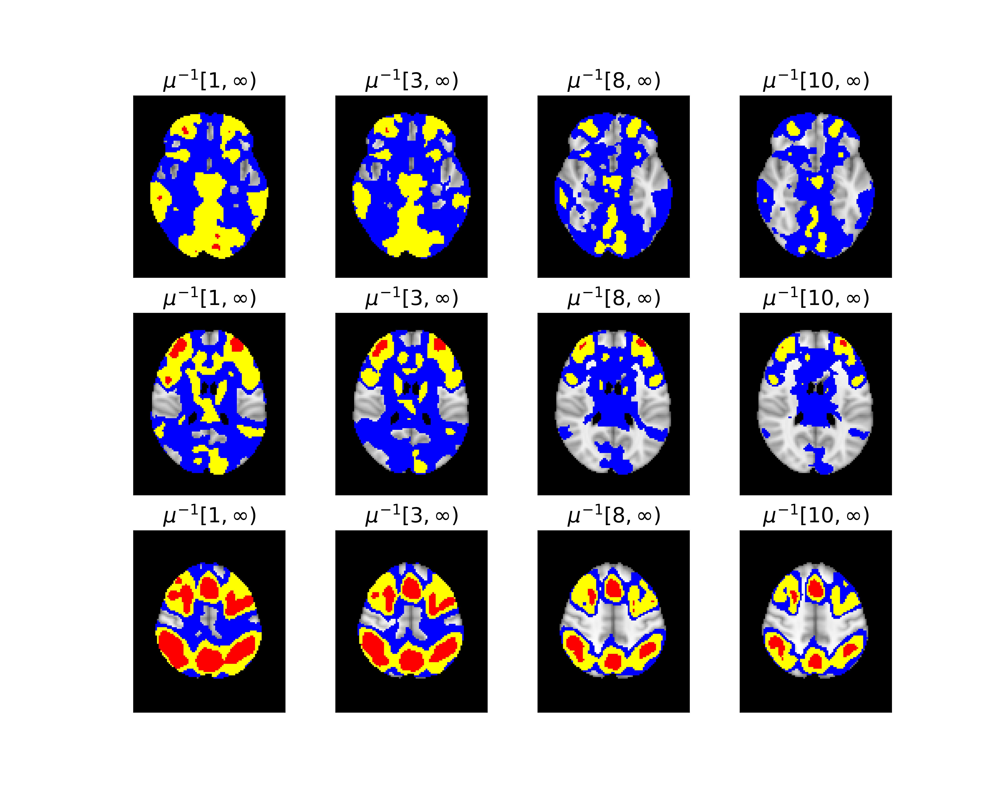

# SimuInf
This Python packages implements methods that construct simultaneous confidence regions (SCRs) for an image excursion set. A key advantage of SCRs is that they provide valid inference simultaneously across all activation thresholds. This enables researchers to fully explore the data and choose the thresholds which provide the most interesting results, without concerns about multiple comparison issues over thresholds.  Another strength of our method is that it does not require stationarity, a particular correlation structure or distribution on the noise field. This reduces bias from model misspecification compared to other methods such as classical implementations based on random field theory. 

## Features 
- construct simultaneous confidence bands (SCBs) via various bootstrap methods
- construct simultaneous confidence regions (SCRs) by inverting the SCBs.
- plot the estimated excursion set and SCRs, with interactive tools specific for applications to fMRI 
- perform simulations or 3D resting state validations


## Data to reproduce the analyses

- HCP data: The Human Connectome Project data can be provided upon request after users sign the data use agreement required by HCP, which can be found at https://www.humanconnectome.org/study/hcp-young-adult/data-use-terms

- Data used for resting-state validation: The data are available at http://tinyurl.com/clusterfailure. They were processed by Eklund, A. et al. See reference: *Eklund, A., Nichols, T. E., & Knutsson, H. (2016). Cluster failure: Why fMRI inferences for spatial extent have inflated false-positive rates. Proceedings of the national academy of sciences, 113(28), 7900-7905.*


## Usage

### Initial setup

1. Create a Python 3.9 or newer virtual environment.

   *If you're not sure how to create a suitable Python environment, the easiest way is using [Miniconda](https://docs.conda.io/en/latest/miniconda.html). On a Mac, for example, you can install Miniconda using [Homebrew](https://brew.sh/):*


    ```
    brew install miniconda
    ```

   *Then you can create and activate a new Python environment by running:*

    ```
    conda create --name <env> python=3.9
    conda activate <env>
    ```

2. Install the package by running:

    ```
    pip install git+https://github.com/JiyueQin/SimuInf.git
    ```

### Examples 

- construct simultaneous confidence regions 

```
#  construct SCB by a certain bootstap method, default is Rademacher multiplier-t 
from SimuInf import scb, confset
from SimuInf.plotting import confset_plot, ls_plot
est, lower, upper = scb.confband(data, m_boots=1000)

# construct confidence regions based on a list of thresholds
threshold_ls = 1+np.arange(10)
set_masked_ls = [list(confset.confset(est, lower, upper, threshold=threshold)) for threshold in threshold_ls]

# unmask to transform to 3d, this returns a list of Nifti1Imagec
set_unmasked_img_ls = [[masker.inverse_transform(set) for set in set_ls] for set_ls in set_masked_ls]
set_unmasked_ls = [[get_data(set) for set in img_ls] for img_ls in set_unmasked_img_ls]
```


-  visualize the results with guarantees on statistical regior

```
# visualize at thresholds of 1,3,8,10. 
name_ls = [f'$\mu^{{-1}}[{i}, \infty)$' for i in threshold_ls]
set_unmasked_ls_selected = list(np.array(set_unmasked_ls)[[0,2,7,9]])
name_ls_selected = list(np.array(name_ls)[[0,2,7,9]])
confset_plot(set_unmasked_ls_selected, name_ls_selected, nrow=3, figsize=(10,8), fontsize=15, 
background =brain, cuts = [30,45,60], ticks=False)
```



- interactive tool

Check out the interactive visualization tool at https://jiyueqin.shinyapps.io/fmri_volume/
 